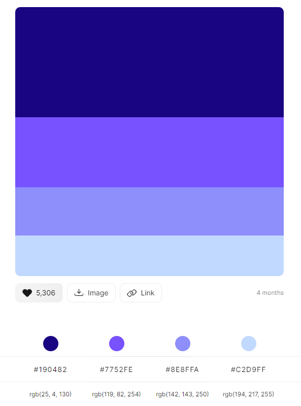

# 🏨 Documento de Diseño de la Interfaz de Usuario
Especificación de la paleta de colores e interfaces tentativas de la aplicación.

## 📋 Tabla de contenido
- [Logo](#💭-logo).
- [Paleta de Colores](#🎨-paleta-de-colores).
- [Listado de Interfaces](#🗒️-listado-de-interfaces).
    - [Homepage](#homepage).
    - [Registro](#registro).
    - [Inicio de sesión](#inicio-de-sesión).
    - [Listado de hospedajes](#listado-de-hospedajes).
    - [Detalles de un hospedaje](#detalles-de-un-hospedaje).
    - [Adición/Edición de hospedaje](#adición-edición-de-hospedaje).
    - [Paginas de error con fotos de perros como en amazon](#paginas-de-error-con-fotos-de-perros-como-en-amazon).

## 💭 Logo
texto...

## 🎨 Paleta de Colores
Se elegió una paleta de colores la cual está conformada por cuatro tonos principales:
- #190482
- #7752FE
- #8E8FFA 
- #C2D9FF

## 🗒️ Listado de interfaces
### Homepage
### Registro
### Inicio de sesión
### Listado de hospedajes
### Detalles de un hospedaje
### Adición/Edición de hospedaje